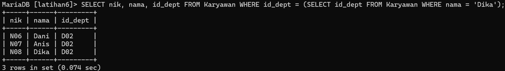
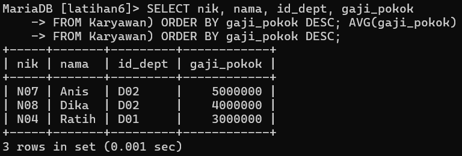
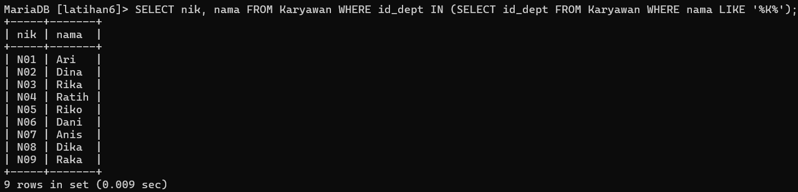
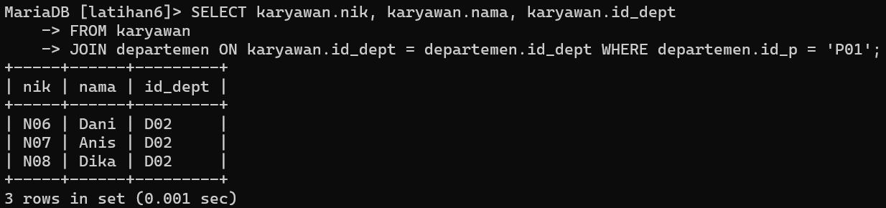
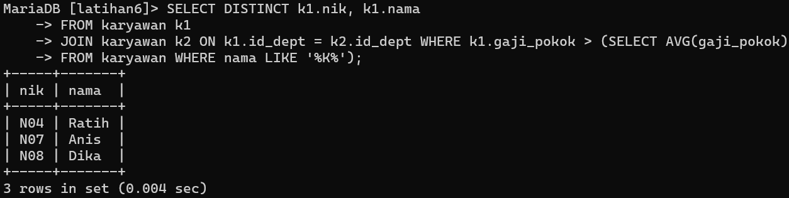

# Tugas Praktikum { Pertemuan ke 15 }


## Profil
| Variable | Isi |
| -------- | --- |
| **Nama** | Arif Bagus Pramono |
| **NIM** | 312310445 |
| **Kelas** | TI.23.A.5 |
| **Mata Kuliah** | Basis data |


# Soal latihan praktikum 7

### 1. Tampilkan data karyawan yang bekerja pada departemen yang sama dengan karyawan yang bernama Dika

```
SELECT nik, nama, id_dept FROM Karyawan WHERE id_dept = (SELECT id_dept FROM Karyawan WHERE nama = 'Dika');
```
**Output :**



### 2. Tampilkan data karyawan yang gajinya lebih besar dari rata-rata gaji semua karyawan. Urutkan menurun berdasarkan besaran gaji

```
SELECT nik, nama FROM Karyawan WHERE id_dept IN (SELECT id_dept FROM Karyawan WHERE nama LIKE '%K%');
```

**Output :**



### 3. Tampilkan nik dan nama karyawan untuk semua karyawan yang bekerja di departmen yang sama dengan karyawan dengan nama yang mengandung huruf 'K'.

```
SELECT nik, nama FROM Karyawan WHERE id_dept IN (SELECT id_dept FROM Karyawan WHERE nama LIKE '%K%');
```

**Output :**



### 4. Tampilkan data karyawan yang bekerja pada departemen yang ada di Kantor pusat.

```
SELECT karyawan.nik, karyawan.nama, karyawan.id_dept FROM karyawan JOIN departemen ON karyawan.id_dept = departemen.id_dept WHERE departemen.id_p = 'P01';
```

**Output :**



### 5. Tampilkan nik dan nama karyawan untuk semua karyawan yang bekerja di departmen yang sama dengan karyawan dengan nama yang mengandung huruf 'K' dan yang gajinya lebih besar dari rata-rata gaji semua karyawan

```
SELECT DISTINCT k1.nik, k1.nama FROM karyawan k1 JOIN karyawan k2 ON k1.id_dept = k2.id_dept WHERE k1.gaji_pokok > (SELECT AVG(gaji_pokok) FROM karyawan WHERE nama LIKE '%K%');
```

**Output :**



# Terimakasih
# MySQL7
